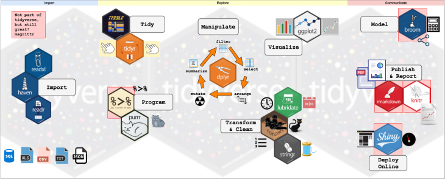

```{r setup, include=FALSE}
knitr::opts_chunk$set(echo = FALSE, fig.align = "center")
```

# Introducción a Tidyverse.

https://www.tidyverse.org/

```{r, out.width='300px'}
knitr::include_graphics("img/hex-tidyverse.png")
```


## Tidyverse


Es una colección de paquetes de R diseñados para la *ciencia de datos* que facilitan la manipulación, exploración y visualización de datos.

Todos los paquetes comparten una **filosofía** de diseño, gramática y estructuras de datos. 

```{r, out.height='200px', out.width='250px'}
knitr::include_graphics("img/rstudio_packages.jpg")
```

<font size="2"> La mayoría de los paquetes fueron originalmente diseñados por Hadley Wickham pero ahora hay muchos contribuidores.</font>


## Flujo de trabajo


```{r, out.width='550px'}

```

> Entorno accesible para el análisis de datos.


## Core `tidyverse`

Está diseñado para facilitar la instalación y la carga de varios paquetes en un solo comando.
```{r, eval = T, echo = T}
# install.packages("tidyverse")
library("tidyverse")
```


## Paquetes principales

```{r, out.width="100%"}

```

## Paquetes principales

```{r, out.width="100%"}
knitr::include_graphics("img/core_packages2.png")
```


# Pipe

`magrittr`

```{r, out.width='250px'}

```

<span style="color:white">El objetivo de usar *pipes* es hacer el desarrollo de código
**más fácil de escribir, mas rápido de leer y más sencillo 
de dar mantenimiento.**</span>


## Operador `%>%` 

Funciona con el operador **forward pipe** `%>%` 
que envía un valor a una función. 

```{r, out.width='200px'}
knitr::include_graphics("img/pipes.png")
```

La función básica puede verse de la siguiente forma:

- `x %>% f` equivale a `f(x)`.
- `x %>% f(y)` equivale a `f(x, y)`.
- `x %>% f %>% g %>% h` equivale a `h(g(f(x)))`.


## Argumentos 

Colocación de valores en argumentos por posición 
se realiza con un punto `.`:

- `x %>% f(y, .)` equivale a `f(y, x)`.
- `x %>% f(y, z = .)` equivale a `f(y, z = x)`


**Shortcut**
```
El shortcut de forward pipe `%>%` es command/ctrl + shift + m
```


## Pipe: ejemplo sin pipe
```{r, echo=TRUE}
library(nycflights13)
foo1 <- filter(flights, carrier == "UA")
foo2 <- arrange(foo1, desc(dep_time))
head(foo2, 3)
```

## Pipe: ejemplo con pipe
```{r, echo=TRUE}
 flights %>% 
  filter(carrier == "UA") %>% 
  arrange(desc(dep_time)) %>% 
  head(3)
```


## Pipeline

```{r, out.width='700px'}
knitr::include_graphics("img/data-science-program.png")
```

1. Manipular
2. Explorar
3. Visualizar
4. Modelar


# Manipular

```{r, out.width='500px'}
knitr::include_graphics("img/data-science-wrangle.png")
```


> El arte de tener los datos en R en una forma útil para la visualización y modelado


## EJ: Importar datos

```{r, echo=T}
df_ejercicio <- read_csv("data/datos_ejercicio.csv")
```


## EJ: Imprimir datos

```{r, echo=T}
df_ejercicio
```


## `filter()` y `arrange()`

```{r, echo = T}
# Filtrar y ordenar
df_fo <- df_ejercicio %>% 
  filter(indicador %in% c("analfabeta", "sin_primaria", "poblacion")) %>% 
  arrange(ent_mun, indicador)%>% 
  mutate(est = str_sub(ent_mun, start = 1, end = 2),
         mun = str_sub(ent_mun, start = 3, end = 5)) %>% 
  select(-ent_mun)
df_fo 
```

## `gather()` y `spread()`

```{r, echo = T}
df_gather <- df_fo %>% 
  gather(key = year, 
         value = valor, 
         c(`2015`, `2016`))
df_gather
```

## `gather()` y `spread()`

```{r, echo = T}
df_tidy <- df_gather %>% 
  spread(key = indicador, 
         value = valor) 
df_tidy
```


# Explorar

```{r, out.width='500px'}
knitr::include_graphics("img/data-science-explore.png")
```


> Mirar los datos, generar hipótesis rápidamente, probarlas rápidamente y luego repetirlas una y otra vez. 
Generar muchas pistas.


## Separar, aplicar y combinar
`group_by()`, `mutate()` y `summarise()`

```{r, echo = T}
df_resumen <- df_tidy  %>% 
  # ordenar para obtener diferencia poblacional
  arrange(est, mun, year) %>% 
  # tidyverse verbs
  mutate_at(.vars = c('analfabeta', 'poblacion', 'sin_primaria'), 
            .funs = parse_number) %>% 
  # agrupar por estado y municipio
  group_by(est, mun) %>% 
  # diferencia de poblacion de 2015 a 2016
  mutate(analfabeta = mean(analfabeta, na.rm = T), 
         sin_primaria = mean(sin_primaria, na.rm = T),
         dif_poblacion = diff(poblacion), 
         difp_poblacion = dif_poblacion/poblacion) %>% 
  # desagrupar
  ungroup %>% 
  # únicamente cambio porcentual de 2016
  filter(year == '2016')  
```

## EJ: separar, aplicar y combinar

```{r, echo = T}
df_resumen
```


# Visualizar

```{r, out.width='500px'}
knitr::include_graphics("img/data-science-communicate.png")
```


> "Una gráfica simple ha traído más información a la mente del analista de datos que cualquier otro recurso." - John Tukey


## `ggplot2`

Es una sistema para crear gráficos basado en la gramática de gráficos con los mismos elementos.

Se basa en el trabajo de Wilkinson y propone la **gramática en capas** o layered grammar of graphics adaptado a R.

La gramática nos dice que un gráfico estadístico es un mapeo de datos a **atributos estéticos** de **objetos geométricos** en **sistemas de coordenadas** específicos.


## Componentes

Existen tres componentes básicos en ggplot2:

1. `data`: Dataframe de datos a graficar.
2. `aes aesthetic mappings`: Mapeo de las variables del conjunto de datos y la propiedades visuales a valores estéticos de la gráfica.
3. `geoms`: Al menos una capa con objetos geométricos que describan como tratar cada observación.

```{r, out.width="400px"}
knitr::include_graphics("img/ggplot-component1.png")
```


## EJ: analfabeta vs sin primaria
```{r, echo = T, fig.height=3, fig.width=4}
df_resumen %>% 
  filter(est %in% c("07", "09", "28", "30")) %>% 
  ggplot(aes(x = analfabeta, y = sin_primaria, 
             color = est)) + 
  geom_point(alpha = .5, size = 2)
```


## EJ: analfabeta vs crecimiento poblacional
```{r, echo = T, fig.height=3, fig.width=4}
df_resumen %>% 
  filter(est %in% c("07", "09", "28", "30")) %>% 
  ggplot(aes(x = analfabeta, y = difp_poblacion, 
             color = est)) + 
  geom_point(alpha = .5, size = 2)
```


## EJ: Algunas modificaciones
```{r, echo = T, eval = F}
df_resumen %>% 
  filter(est %in% c("07", "09", "28", "30")) %>% 
  # recodificación de factores
  mutate(est = forcats::fct_recode(est, 
                          chiapas = '07',
                          cdmx = '09',
                          tamaulipas = '28',
                          veracruz = '30')) %>% 
  ggplot(aes(x = sin_primaria, y = difp_poblacion, 
             color = est)) + 
  geom_point(alpha = .5, size = 2) + 
  # etiquetas
  ylab("Diferencia porcentual\npoblación") + 
  xlab("Porc. sin primaria") + 
  ggtitle("Relación de variables.", 
          "Información por municipio.") + 
  guides(color = guide_legend(title = "Entidad"))
```

## EJ: Grafica con modificaciones

```{r, echo = F, eval = T}
df_resumen %>% 
  filter(est %in% c("07", "09", "28", "30")) %>% 
  # recodificación de factores
  mutate(est = forcats::fct_recode(est, 
                          chiapas = '07',
                          cdmx = '09',
                          tamaulipas = '28',
                          veracruz = '30')) %>% 
  ggplot(aes(x = sin_primaria, y = difp_poblacion, 
             color = est)) + 
  geom_point(alpha = .5, size = 2) + 
  # etiquetas
  ylab("Diferencia porcentual\npoblación") + 
  xlab("Porc. sin primaria") + 
  ggtitle("Relación de variables.", 
          "Información por municipio.") + 
  guides(color = guide_legend(title = "Entidad"))
```

# Modelar

```{r, out.width='500px'}
knitr::include_graphics("img/data-science-model.png")
```


## Regresión lineal

```{r, echo = T}
mod_1 <- lm(formula = difp_poblacion ~ sin_primaria, data = df_resumen)
summary(mod_1)
```

## `broom`

Convierte en data frames ordenados la salida desordenada de las funciones incorporadas en R, como lm, nls o t.test.

```{r, out.width="90px"}

```

```{r, echo = T}
library(broom)
tidy(mod_1)
```


## `modelr`  

Proporciona funciones que ayudan a crear *pipelines* elegantes al modelar.

```{r, echo = T, warning=F, message=FALSE}
library(modelr)
tab_results <- df_resumen %>% 
  # agrega una columna de predicciones
  modelr::add_predictions(model = mod_1) %>% 
  # agrega una columna de residuales
  modelr::add_residuals(model = mod_1)
```

## EJ: Resultados

```{r, echo = F, eval = T}
tab_results %>% data.frame() %>% head
```


## EJ: Función `do()`

```{r, echo = T}
# Un poco mas complicado
modelo_fun <- function(sub_tab){
  mod <- lm(formula = difp_poblacion ~ sin_primaria, data = sub_tab)
  broom::tidy(mod)
}

tbl_modelos <- df_resumen %>% 
  # divido en subgrupos por estado
  group_by(est) %>% 
  # aplicar la función para cada subgrupo
  do(modelo_fun(sub_tab = .))
```

## EJ: Tabla

```{r}
tbl_modelos %>% head(8)
```


## EJ: Grafica de coeficientes

```{r, echo = T, fig.height=3, fig.width=4}
library(ggrepel)
tbl_modelos %>% select(est:estimate) %>% 
  spread(term, estimate) %>% 
  ggplot(aes(x = `(Intercept)`, y = sin_primaria)) + 
  geom_text_repel(aes( label = est)) +
  geom_point()
```


## EJ: Mas información

```{r, echo = T}
modelo_fun2 <- function(sub_tab){
  mod <- lm(formula = difp_poblacion ~ sin_primaria, data = sub_tab)
}

tbl_modelos_2 <- df_resumen %>% 
  group_by(est) %>% 
  do(modelo = modelo_fun2(sub_tab = .), 
     #guardar el modelo
     coefs = broom::tidy(x = modelo_fun2(sub_tab = .)), 
     # coeficientes en dataframe
     rmse = modelr::rmse(model = modelo_fun2(sub_tab = .),
                         data = .) )
     # calcula rmse
```

## EJ: Tabla
```{r, echo = T}
tbl_modelos_2 %>% head 
```


## Libro GRATIS

http://r4ds.had.co.nz/introduction.html

```{r}
knitr::include_graphics("img/cover.png")
```


## Más paquetes de `tidyverse`

```{r, out.width='800px'}

```


## Algunas referencias: 

Video: https://www.rstudio.com/resources/videos/data-science-in-the-tidyverse/

Cursos gratis: https://www.tidyverse.org/learn/#datacamp

Algunos libros: https://www.tidyverse.org/learn/#books

Cheat sheets: https://www.rstudio.com/resources/cheatsheets/

Más cheat sheets: https://s3.amazonaws.com/assets.datacamp.com/blog_assets/Tidyverse+Cheat+Sheet.pdf

CRAN: https://cran.r-project.org/web/packages/tidyverse/index.html

Los verbos básicos: https://github.com/animalito/tidyverse-verbs


## ¡Gracias!


### Material, código y presentación:

Github: https://github.com/Songeo/intro_tidyverse_2018.git

### Contacto:

github: [Songeo](https://github.com/Songeo)

email: sonia.gmcl@gmail.com
